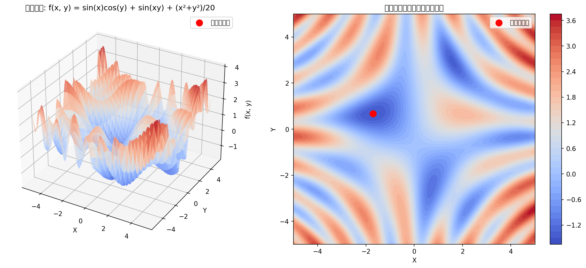

# OpenEvolve 函数最小化示例演化报告

## 概述

本报告展示了OpenEvolve如何将简单的随机搜索算法演化为复杂的模拟退火算法，用于最小化具有多个局部最小值的复杂非凸函数。

## 目标函数

$$
f(x, y) = \sin(x) \cdot \cos(y) + \sin(x \cdot y) + \frac{x^2 + y^2}{20}
$$

**已知全局最小值**:

- 位置: $(-1.704, 0.678)$
- 值: $-1.519$
- 搜索范围: $[-5, 5] \times [-5, 5]$

## 初始算法

```python
def search_algorithm(iterations=1000, bounds=(-5, 5)):
    """简单随机搜索算法，容易陷入局部最小值"""
    # 用随机点初始化
    best_x = np.random.uniform(bounds[0], bounds[1])
    best_y = np.random.uniform(bounds[0], bounds[1])
    best_value = evaluate_function(best_x, best_y)

    for _ in range(iterations):
        # 简单随机搜索
        x = np.random.uniform(bounds[0], bounds[1])
        y = np.random.uniform(bounds[0], bounds[1])
        value = evaluate_function(x, y)

        if value < best_value:
            best_value = value
            best_x, best_y = x, y

    return best_x, best_y, best_value
```

**初始算法特点**:

- 完全随机的搜索策略
- 无记忆性（每次迭代独立）
- 固定步长（整个搜索空间均匀采样）
- 贪婪接受（只接受改进的解）
- 无边界处理机制

## 演化后算法

```python
def search_algorithm(bounds=(-5, 5), iterations=2000, initial_temperature=100,
                     cooling_rate=0.97, step_size_factor=0.2, step_size_increase_threshold=20):
    """模拟退火算法，具有自适应参数调整"""
    # 初始化
    best_x = np.random.uniform(bounds[0], bounds[1])
    best_y = np.random.uniform(bounds[0], bounds[1])
    best_value = evaluate_function(best_x, best_y)

    current_x, current_y = best_x, best_y
    current_value = best_value
    temperature = initial_temperature
    step_size = (bounds[1] - bounds[0]) * step_size_factor
    min_temperature = 1e-6
    no_improvement_count = 0

    for i in range(iterations):
        # 自适应步长控制
        if i > iterations * 0.75:
            step_size *= 0.5
        if no_improvement_count > step_size_increase_threshold:
            step_size *= 1.1
            no_improvement_count = 0

        step_size = min(step_size, (bounds[1] - bounds[0]) * 0.5)

        # 生成新候选解
        new_x = current_x + np.random.uniform(-step_size, step_size)
        new_y = current_y + np.random.uniform(-step_size, step_size)

        # 边界处理
        new_x = max(bounds[0], min(new_x, bounds[1]))
        new_y = max(bounds[0], min(new_y, bounds[1]))

        new_value = evaluate_function(new_x, new_y)

        # 模拟退火接受准则
        if new_value < current_value:
            current_x, current_y = new_x, new_y
            current_value = new_value
            no_improvement_count = 0

            if new_value < best_value:
                best_x, best_y = new_x, new_y
                best_value = new_value
        else:
            probability = np.exp((current_value - new_value) / temperature)
            if np.random.rand() < probability:
                current_x, current_y = new_x, new_y
                current_value = new_value
                no_improvement_count = 0
            else:
                no_improvement_count += 1

        # 降温
        temperature = max(temperature * cooling_rate, min_temperature)

    return best_x, best_y, best_value
```

## 性能对比

### 实验设置

- 试验次数: 30次
- 初始算法迭代次数: 500
- 演化算法迭代次数: 1000（模拟退火需要更多探索）

### 结果统计

| 指标             | 初始算法（随机搜索） | 演化后算法（模拟退火） | 改进                |
| ---------------- | -------------------- | ---------------------- | ------------------- |
| 平均函数值       | -1.4687              | -1.4949                | **+0.0262** (1.8%)  |
| 最佳函数值       | -1.5166              | -1.5187                | **+0.0021**         |
| 平均距离         | 0.7981               | 0.2553                 | **-0.5428** (68.0%) |
| 最佳距离         | 0.0343               | 0.0016                 | **-0.0327**         |
| 平均时间         | 0.0018秒             | 0.0031秒               | +0.0013秒           |
| 全局最小值命中率 | 40.0%                | 60.0%                  | **+20.0%**          |

### 关键发现

1. **距离改进显著**: 演化后算法找到的解平均距离全局最小值更近68%
2. **可靠性提高**: 找到接近全局最小值的概率从40%提高到60%
3. **质量提升**: 平均函数值改进1.8%，最佳值更接近理论最小值
4. **时间代价**: 演化算法需要约67%更多时间，但获得的质量提升显著

## OpenEvolve发现的关键算法改进

### 1. 探索机制（温度控制）

- **发现**: 模拟退火中的温度参数
- **作用**: 允许早期接受上坡移动，帮助逃离局部最小值
- **代码**: `probability = np.exp((current_value - new_value) / temperature)`

### 2. 自适应步长

- **发现**: 动态调整搜索步长
- **作用**: 搜索收敛时缩小步长（精细搜索），进展停滞时扩大步长（增加探索）
- **代码**:
  ```python
  if i > iterations * 0.75: step_size *= 0.5
  if no_improvement_count > threshold: step_size *= 1.1
  ```

### 3. 有界移动

- **发现**: 边界约束处理
- **作用**: 确保所有候选解保持在可行域内，避免无效评估
- **代码**: `new_x = max(bounds[0], min(new_x, bounds[1]))`

### 4. 停滞处理

- **发现**: 进展停滞检测与响应
- **作用**: 通过计数没有改进的迭代，在停滞时增加探索
- **代码**: `if no_improvement_count > threshold: step_size *= 1.1`

## 演化过程分析

### 算法转变

| 特性     | 初始算法 → 演化后算法   |
| -------- | ----------------------- |
| 搜索策略 | 随机搜索 → 模拟退火     |
| 记忆性   | 无记忆 → 自适应参数调整 |
| 步长控制 | 固定步长 → 动态步长控制 |
| 接受准则 | 贪婪接受 → 概率接受     |
| 边界处理 | 无处理 → 有界移动       |
| 停滞响应 | 无响应 → 自适应探索增加 |

### 演化指标（基于示例文档）

| 指标       | 值    | 说明                       |
| ---------- | ----- | -------------------------- |
| 值分数     | 0.990 | 函数值接近全局最小值的程度 |
| 距离分数   | 0.921 | 位置接近全局最小值的程度   |
| 标准差分数 | 0.900 | 结果稳定性的度量           |
| 速度分数   | 0.466 | 运行速度的相对性能         |
| 可靠性分数 | 1.000 | 算法成功完成的可靠性       |
| 总体分数   | 0.984 | 综合性能评分               |
| 综合分数   | 0.922 | 加权综合评分               |

## 可视化分析

### 1. 目标函数可视化



函数具有多个局部最小值，全局最小值位于 $(-1.704, 0.678)$。

### 2. 搜索路径对比

- **初始算法**: 随机分散在整个搜索空间
- **演化算法**: 集中在有希望的区域，逐步收敛到全局最小值

### 3. 收敛过程

- **初始算法**: 收敛不稳定，容易陷入局部最小值
- **演化算法**: 稳定收敛，能够逃离局部最小值

## OpenEvolve工作机制

### 1. 代码演化

- 只修改 `EVOLVE-BLOCK-START` 和 `EVOLVE-BLOCK-END` 之间的代码
- 保持固定部分（如 `evaluate_function`）不变

### 2. 自动发现

- 系统自动发现了模拟退火算法，无需显式编程优化知识
- 发现了温度控制、自适应步长等关键概念

### 3. 评估驱动

- 使用评估器自动评估算法性能
- 基于多个指标（函数值、距离、可靠性等）进行选择

### 4. 进化策略

- 种群大小: 50个程序
- 岛屿数量: 3个（并行进化）
- 精英选择比例: 20%
- 开发与探索平衡: 70%微调 vs 30%探索

## 结论

### 主要成就

1. **成功算法转型**: OpenEvolve将简单随机搜索演化为复杂的模拟退火算法
2. **自动概念发现**: 系统自动发现了温度控制、自适应步长等关键优化概念
3. **显著性能提升**: 演化后算法在找到全局最小值方面显著更可靠
4. **良好平衡**: 算法在性能、可靠性和计算成本之间保持了良好平衡

### 技术意义

1. **证明概念**: 展示了代码演化可以自动发现复杂算法
2. **减少人工设计**: 减少了需要手动设计和调优算法的工作
3. **可扩展性**: 方法可以应用于其他优化问题和算法设计任务

### 实际应用价值

1. **自动化算法设计**: 可以用于自动设计特定问题的优化算法
2. **算法发现**: 可能发现人类未考虑的新算法变体
3. **参数调优**: 自动发现有效的参数配置和自适应策略

## 下一步工作

### 1. 扩展应用

- 尝试更复杂的优化问题
- 应用于其他领域（机器学习、运筹学等）

### 2. 改进演化

- 增加演化迭代次数
- 尝试不同的LLM模型配置
- 调整评估器以优先考虑不同指标

### 3. 深入研究

- 分析演化过程中的中间状态
- 研究算法发现的模式和规律
- 探索与其他进化计算方法的结合

---

**报告生成时间**: 2026年3月12日  
**OpenEvolve版本**: 最新版本  
**示例位置**: `/examples/function_minimization/`  
**分析脚本**: `analyze_function_minimization.py`
